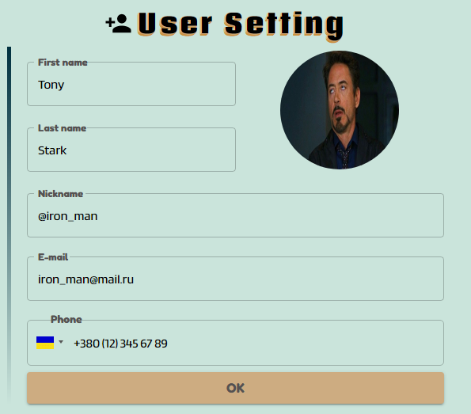

# Welcome to KEEPOCKET!

We really appreciate your choice!
Let's start your jorney to a better life together with our poduct!

## KEEPOCKET aim and options

KEEPOCKET was created to enhance the tracking of incomes and expenses as well as provide the relevant analystics to a user.
The basic options avaliable in the application are: 
* adding the records of incomes / expenses;
* presenting of entered data in a form of tables or graphs;
* customization of user settings, including avatar and nickname adding;
* setting a limit of a balance and a reminer to notify if the user is going to get below the limit;
* forecasting of income and expenses, based off of actual data, for 2 weeks in advance.

## KEEPOCKET structure

### Setting

#### Setting User
Here you can add personal information and choose yor avatar.
This information will be shown on the main page and in the table of incomes / expenses.

#### Reminder
Here you can set your balance limit *(in UAH or %)*.
If the limit is set and the option of reminder is activated (active tick near *"Remind me when my balance will be lower than limit"*) you will receive a notification when entering a charge that will get you below the limit.

#### Categories
Here you can manage you categories of incomes and expenses: 
*add new category, rename and change the icon for existing one, or even delete a category*.

### Data
**Your current balance will be always shown here**.
If you are having a great month and somehow spent more money that earned - the balance will turn *red*.
**Don't let it be red!**

#### Tables

##### Charges
All the charges in one place!
Easy to navigate, add or delete the record.
Please pay attention on notification here that might be shown while adding a charge - it will help you to save the money!

##### Incomes
All the incomes in one place!
This is the most joinful page, isn't it?
Easy to navigate, add or delete the record.

### Graphics

Choose the type of data (incomes or expenses), date range and the type of graph - ta-da! - a little magic and you receive your analytics!
- **Donut chart** will show you a recentage of each category in the total sum of income / expenses. 
- **Linear chart** is a simple way to track the chronological change of your incomes / expenses.
- **Bar chart** combines the chronological and category view.
- **Forecast** will emulate you incomes and expenses 2 weeks beforehand basing on the historial data.

**Enjoy your time with KEEPOCKET!**

